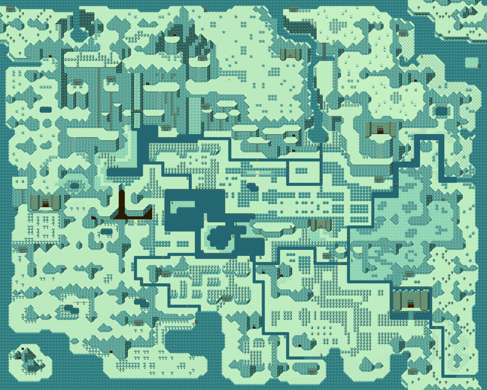

# Part1 - The quest for maps

Ah, maps. Always a highly visible part of a game. It has to be somewhere, and there has to be a lot of it. I forgot how I discovered the first bit.
So lets just explain how it all works. Or at least, how part of it works, as there is a part of it we will cover later.

## Humble beginnings

Map data starts at bank $08, at the beginning of the bank. It's stored at [src/data/map/headers.asm](https://github.com/daid/FFA-Disassembly/blob/master/src/data/map/headers.asm) in the disassembly.
There are a wopping total of 16 maps. That is a lot of maps. But not all maps are the same size, and not all maps are completely used.
```asm
MAP_HEADER tilesetGfxOutdoor, $00, metatilesOutdoor, $80, mapRoomPointers_00, $d7, $3c
```
Per map there is a header here. Which is just a few pointers to other data, as well as some junk data. I'm quite sure the junk data is never used.

## The main bit

The main bit of maps is after the first pointer. The `mapRoomPointers` pointer, it's stored with a bank number, so this data can be in any bank.

The data after the `mapRoomPointers` starts with a small header, and then a large list of pointers. The disassembly has this nicely split into files per map in `src/data/map/XX_rooms.asm`.

```asm
mapRoomPointers_00:
    db   $00, $03, $10, $10
    ;;Room data pointers
    dw   map00_room00_00_script, map00_room00_00_tiles
    dw   map00_room01_00_script, map00_room01_00_tiles
```

The header bytes are as followed:
1. Encoding mode: $00 = RLE, $01 = Templated
2. RLE length (more on this in a bit)
3. Height of the map in rooms
4. Width of the map in rooms

There are two types of map encoding, dictated by the first byte. We will cover RLE mode first, as templated mode builds on top of that.

### RLE Map encoding

Each of the `mapXX_roomXX_XX_tiles` pointers points at a block of data. The encoding of this data is quite simple. Each byte is the tile number tile.
$11 might be a water tile, $00 normal ground, and a lot more. There are up to 128 types available. As there is one more rule. If the upper bit is set,
then the tile is repeated a number of times. How often? Well, that's that 2nd byte of the header, the RLE length. So all rooms in a map share a single RLE length.

Example row:
```asm
    db $91, $02, $50, $e4, $64, $64
```
First byte is `$91`, so that's tile `$11` repeated RLE length time. RLE length is 3 in this case. So after this byte the row on that map looks like:
```asm
$11, $11, $11
```
Two bytes after that do not have bit `$80` set, so:
```asm
$11, $11, $11, $02, $50
```
`$e4` follows after that, which has the highest bit set, resulting in tile `$64` repeated 3 times:
```asm
$11, $11, $11, $02, $50, $64, $64, $64
```
And finally two $64 bytes are added:
```asm
$11, $11, $11, $02, $50, $64, $64, $64, $64, $64
```
Making this the complete row.

This is just repeated until the whole room is decoded and the screen is filled. *It's a relatively simple encoding scheme compared to some other games. And I do not think it is a very optimal solution. I am quite sure that an RLE length per room would have been more efficient.*

### Template encoding

If byte 1 of the header is not $00, then the data is encoded differently. And the header is actually expanded:
```asm
mapRoomPointers_02:
    db   $01, $04, $08, $08
    dw   map02_room_tile_template
    ;;Door tile info
    db   $25, $35, $20, $30, $14, $03, $52, $53
    db   $24, $34, $21, $31, $12, $13, $42, $43
    db   $15, $45, $10, $40, $28, $04, $51, $54
    ;;Room data pointers
    dw   map02_room00_00_script, map02_room00_00_tiles
    dw   map02_room01_00_script, map02_room01_00_tiles
```
The first 4 bytes mean exactly the same. But after that a pointer to a room template follows. The pointer points to data in the RLE format and is applied first to the room, before anything else. For the stock maps, this template is just an empty room with all walls nicely done.

Next 24 bytes follow. These are tiles for the right/left/up/down opening/doors/walls. Just remember these as "door tiles" for now.

After this, the actual list of pointers follows, just like in RLE mode. But, the actual mapXX_roomXX_XX_tiles data differs from RLE mode.
```asm
map02_room03_00_tiles:
    db   $02, $00, $02, $01
    db   $41, $44
    db   $41, $46
    db   $41, $52
    db   $ff, $ff
```
The first 4 bytes are "doors", in the order of right/left/up/down this indicate how a wall on that direction should be. If it should be a door or not, and if the door is open.

* Bits0-1: Indicate the type. 0=open, 1=closed, 2=wall
* Bits2-7: Unknown, bits 2 and 3 have been seen as 1.

The first 2 bits are used to select a row from the "door tiles", two tiles are used from this and placed on the wall. So in the example, if the up byte was $01, it would place tile `$12` and `$13` at the top row tiles to draw an closed door.

After the 4 door bytes, you get a list of 2 bytes per item. It's a simple scheme, of `tile` followed by `position`, the position is encoded as YX in a single byte. The list is ended by an entry of `$FF $FF` (but only the first $FF is actually needed) These tiles are simply placed on top of the template.

## The map tiles

Great, now we have a whole room of tiles. Well, we have a room of 16x16 pixel tiles. Or "metatiles" as you can call them. Each of these metatile numbers dictates how a single 16x16 pixel area will ook and behave.

If we want to go from metatiles to actual 8x8 graphic tiles, we need the metatile information. Luckily, this isn't complex. Remember the first map header? 
```asm
MAP_HEADER tilesetGfxOutdoor, $00, metatilesOutdoor, $80, mapRoomPointers_00, $d7, $3c
```
It has a pointer to the metatiles. In this example `metatilesOutdoor`. This has a large list of 6 bytes per metatile:
```asm
metatilesOutdoor:
    db   $2e, $2f, $2e, $2f, $30, $05
    db   $2e, $2f, $9e, $9f, $00, $05
    db   $16, $17, $0e, $18, $60, $07
    db   $27, $10, $10, $10, $c0, $07
    ...124 more entries
```

The first 4 bytes are a 8x8 tile index into the graphics. Which graphics? Well. The graphics pointed at by the pointer in the general header:
```asm
MAP_HEADER tilesetGfxOutdoor, $00, metatilesOutdoor, $80, mapRoomPointers_00, $d7, $3c
```
The `tilesetGfxOutdoor` pointer in this case, which is a bank-encoded pointer, starting from bank `$0B`. And this points to a 256 tile large graphics block. Any tile from that graphics block can be used for a metatile.

Byte 4: not entirely sure, but collision related, should test with enemies to see if certain options are related to NPCs?
* $00-$07: blocks player
* $08: player can walk on it
* $10: player can walk on bottom left and bottom right corners
* $20: player can walk on top left and top right corners
* $30: player can walk on it
* $40: blocks player
* $80: blocks player
* $C0: blocks player
* $F0: player can walk on it

Byte 5: Still needs more investigation, general guess:
* $04: Weapon interaction, byte4 lower nibble indicates which method (1=attach chain, 4=chop by axe, 6=destroy with sickle), but also sometimes is $00 for things like palmtrees and mountains?
* $07: Water
* $45 $55 $65 $75: Ice slide tiles or mine cart tiles
* $0D: climbing tiles (player faces up always)
* $21: Damage spikes

# Wrapping up...

So that's it for maps. Well, mostly. There is one pointer we skipped. The `mapXX_roomXX_XX_script` style pointers. Those are for another day.

With all this, we can make a [script](https://github.com/daid/FFA-Disassembly/blob/master/tools/mapExport.py) that decodes the maps, and it produces nice results:


And then we discover that [map07](img/map07.png) isn't an actual playable map, but contains the title screen, ending screen and ingame map.

* Previous: [Part1 - Adventures of code](part1)
